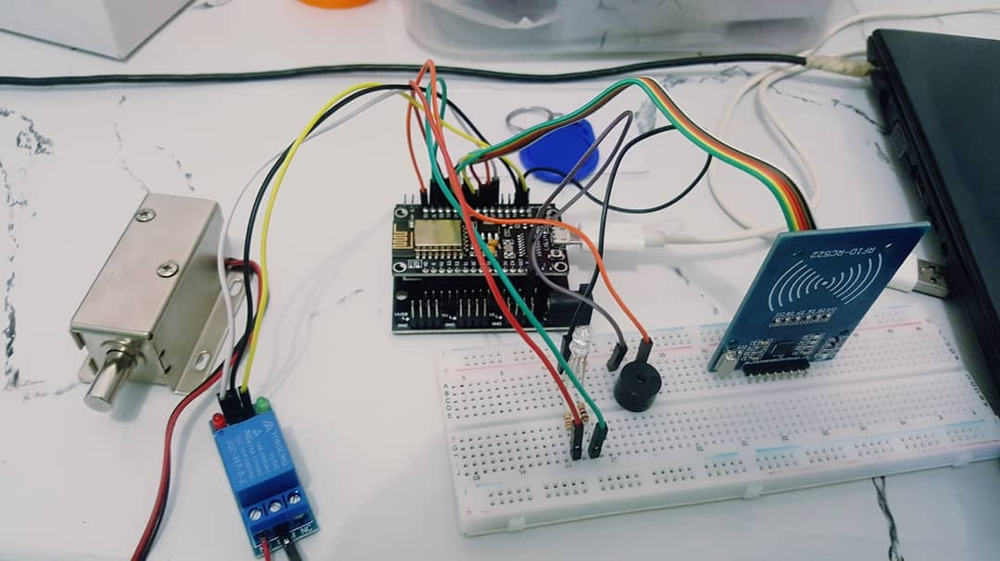

# NodeMCU-RFID-Door-Lock
RFID Door lock using esp8266 with solenoid lock and relay module.

------------------------------------------------
# Parts Used:
-------------
• NodeMCU v3 Lolin ESP8266 IoT
• NodeMcu ESP8266 Base Plate
• MFRC-522 
• 1 Channel Relay 5V Isolated Module
• Solenoid Door Lock DC 12v
• Power Supply 12v
• RGB LED 5MM
• x2 Resistor 1K Ohm 
• Buzzer 5v
• Broadboard 
• Jumper Cables 

# Schematic:
------------

# Connections:
---------------
RFID (MFRC-522)

• 3.3v = 3.3v 
• RST = D3 / PIN20 
• GND = GND 
• IRQ = Not Used
• MISO = D6 / PIN40 
• MOSI = D7 / PIN44 
• SCK = D5 / PIN36 
• SDA = D4 / PIN24 

BUZZER 5V:

• SIGNAL = D0 PIN8 
• GND = GND 

RGB LED:

• RED = D2 / PIN16 
• GREEN = D1 / PIN12 
• GND = GND 

RELAY:

• GND = GND 
• VCC = 3.3V / PIN46 
• IN1 = D8 / PIN50 

Solenoid Lock:

• Solenoid Lock GND = GND +12v Power Supply
• Relay (NO) pin = +12V Power Supply
• Relay (COM) pin = +12v Solenoid Lock

