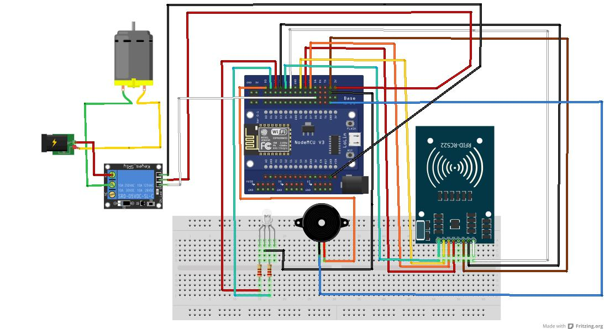

# NodeMCU-RFID-Door-Lock
RFID Door lock using esp8266 with solenoid lock

------------------------------------------------
Parts Used:
-----------
• NodeMCU v3 Lolin ESP8266 IoT
• NodeMcu ESP8266 Base Plate
• MFRC-522 
• 1 Channel Relay 5V Isolated Module
• Solenoid Door Lock DC 12v
• Power Supply 12v
• RGB LED 5MM
• x2 Resistor 1K Ohm 
• Buzzer 5v
• Broadboard 
• Jumper Cables 

#Schematic:
------------

